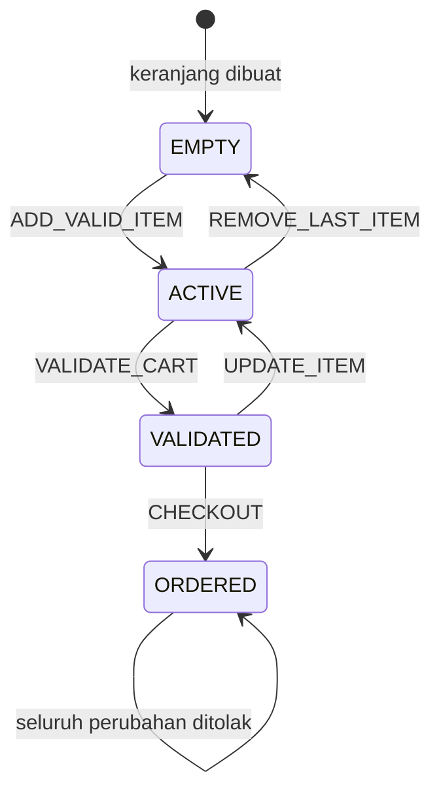

# State Transition — Siklus Keranjang

`VALIDATED` berarti jumlah, stok, dan data keranjang telah diperiksa. Perubahan item mengembalikan
keranjang ke `ACTIVE` agar validasi dijalankan kembali. `ORDERED` merupakan terminal state.
