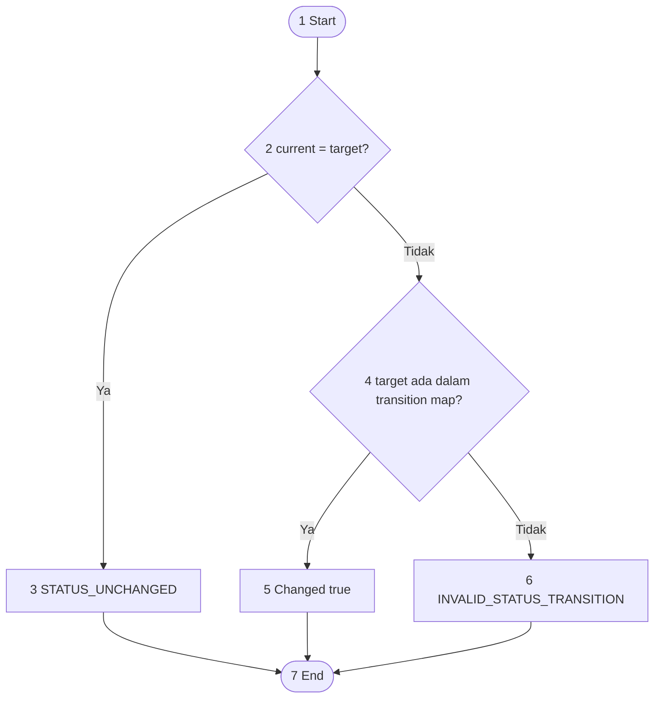

# Control Flow Graph — transitionOrderStatus

```mermaid
flowchart TD
  N1([1 Start]) --> N2{2 current = target?}
  N2 -- Ya --> N3[3 STATUS_UNCHANGED]
  N2 -- Tidak --> N4{4 target ada dalam transition map?}
  N4 -- Ya --> N5[5 Changed true]
  N4 -- Tidak --> N6[6 INVALID_STATUS_TRANSITION]
  N3 --> N7([7 End])
  N5 --> N7
  N6 --> N7
```
