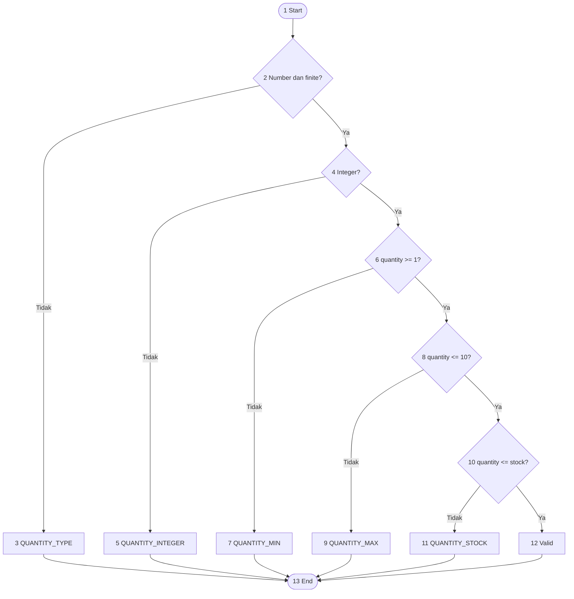

# Control Flow Graph — validateCartQuantity

Composite predicate `typeof quantity === number && Number.isFinite(quantity)` diperlakukan sebagai
satu decision node pada CFG tingkat fungsi. Evaluasi short-circuit internal dicakup oleh branch
coverage melalui input teks dan `NaN`.
