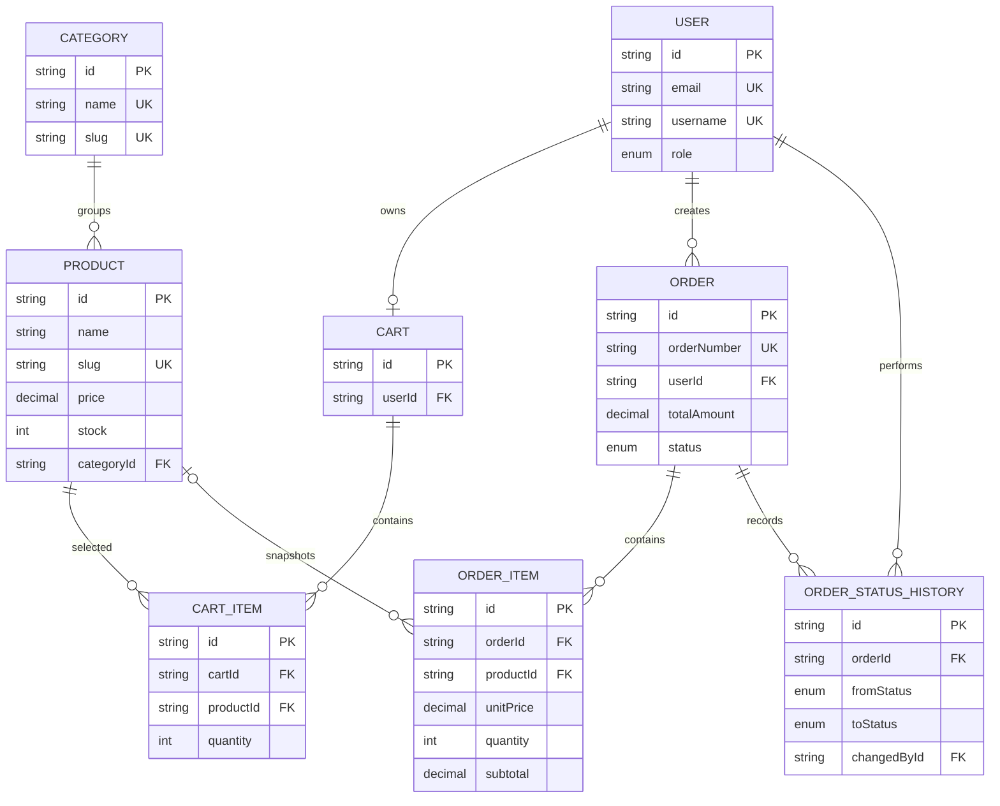

# GreenCart ERD

```mermaid
erDiagram
  USER ||--o| CART : owns
  USER ||--o{ ORDER : creates
  USER ||--o{ ORDER_STATUS_HISTORY : performs
  CATEGORY ||--o{ PRODUCT : groups
  CART ||--o{ CART_ITEM : contains
  PRODUCT ||--o{ CART_ITEM : selected
  ORDER ||--o{ ORDER_ITEM : contains
  PRODUCT o|--o{ ORDER_ITEM : snapshots
  ORDER ||--o{ ORDER_STATUS_HISTORY : records

  USER { string id PK string email UK string username UK enum role }
  CATEGORY { string id PK string name UK string slug UK }
  PRODUCT { string id PK string name string slug UK decimal price int stock string categoryId FK }
  CART { string id PK string userId FK }
  CART_ITEM { string id PK string cartId FK string productId FK int quantity }
  ORDER { string id PK string orderNumber UK string userId FK decimal totalAmount enum status }
  ORDER_ITEM { string id PK string orderId FK string productId FK decimal unitPrice int quantity decimal subtotal }
  ORDER_STATUS_HISTORY { string id PK string orderId FK enum fromStatus enum toStatus string changedById FK }
```

Order item menyimpan snapshot nama dan harga agar perubahan produk tidak mengubah riwayat transaksi.
